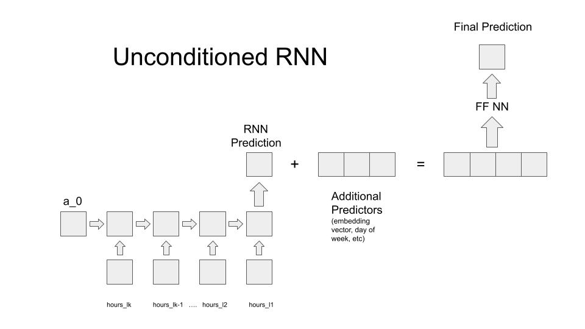
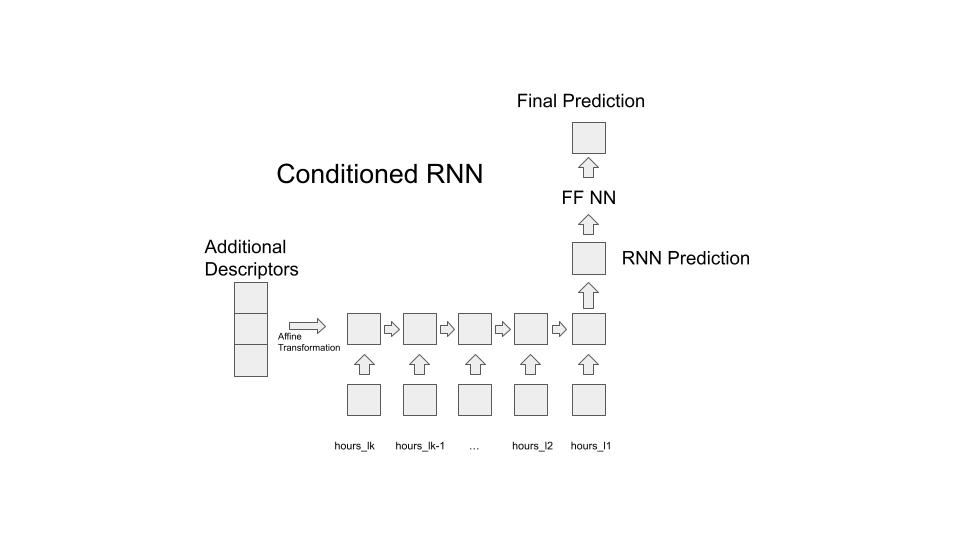

# RNN Prediciton pipeline
Systematically searching for hyperparameters that optimize prediction performance

### Inputs
The input variables for the RNN notebook are the following:

1. Time series data -- Variable
2. Additional predictors -- prov_id, day_of_week, avg_employees, perc_hours_today_before,
   perc_hours_yesterday_before, perc_hours_tomorrow_before

## Model Architectures
The 2 architectures used in this notebook are Unconditioned and Conditioned RNN. In both cases, an lstm layer recieves n days of lagged shift data and makes a prediction for the shift on the n+1th day. In the Conditioned RNN, the hidden state is initialized to a transformed representation of the additional predictors, and the RNN's prediction is directly fed into a FF NN to generate a final prediction. In the Unconditioned RNN, the RNN's output is concatenated with the additional predictors which is then fed into the FF NN to generate a final prediction.

